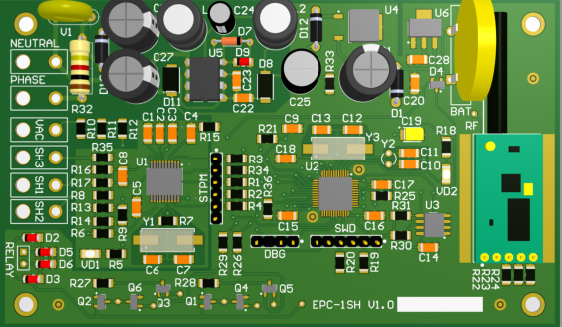
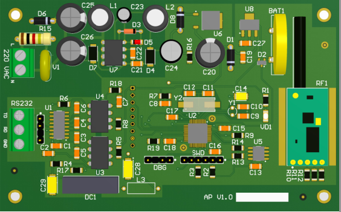

### Электронный двух-тарифный счетчик.
---

Счетчик позволяет учитывать расход активной и реактивной энергии переменного 
тока по двум тарифам. Циклическое хранение накопленных показаний расхода электроэнергии с интервалом 30 минут с продолжительностью до 5 суток. В качестве измерительного элемента используется токовый шунт. Передача данных и управление счетчиком выполняется по радиоканалу. 

### Шлюз доступа к электронному счетчику.
---

Шлюз обеспечивает обмен данными с несколькими счетчиками по радиоканалу. Функционал шлюза:
* Запрос текущих показаний.
* Запрос архивных показаний (глубина до 5 суток).
* Синхронизация даты/времени счетчиков.

Обмен данными со счетчиками выполняется с шифрованием по алгоритму AES c 128 битным ключом.  
Подключение шлюза к внешнему контроллеру выполнятся по гальванически изолированному интерфейсу RS-232.
